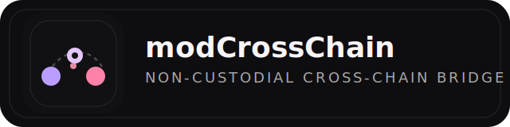
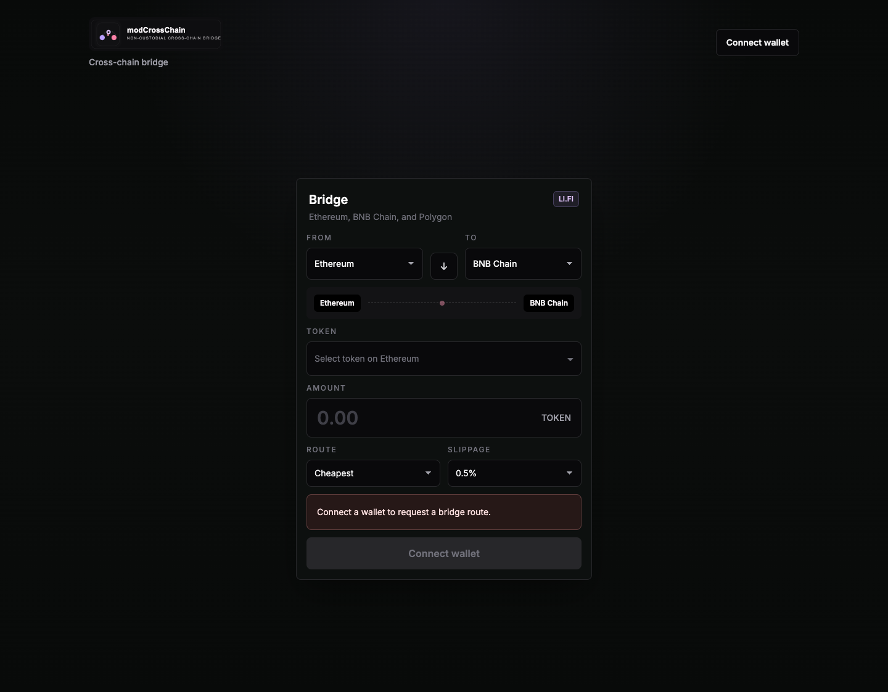
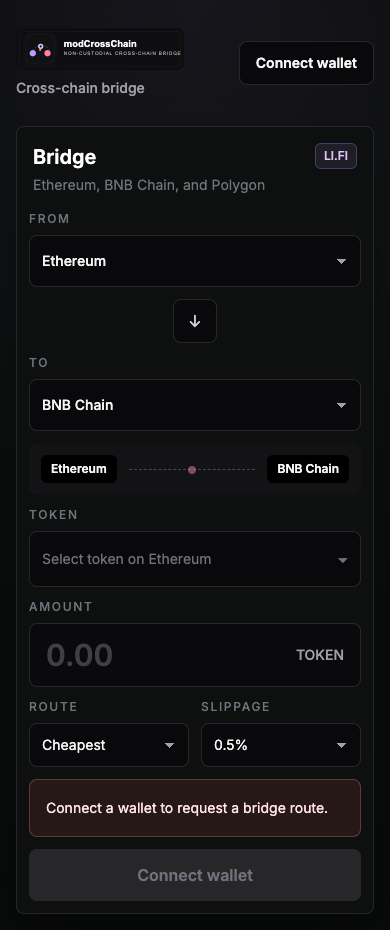

<p align="center">
  
</p>

<p align="center">
  Non-custodial cross-chain bridge UI powered by LI.FI, wagmi, viem, and Next.js.
</p>

<p align="center">
  <a href="https://modcrosschain-production.up.railway.app">Live App</a>
  ·
  <a href="https://wearetheartmakers.github.io/modCrossChain/">GitHub Pages</a>
  ·
  <a href="https://wearetheartmakers.github.io/modCrossChain/terms.html">Terms</a>
  ·
  <a href="https://wearetheartmakers.github.io/modCrossChain/jurisdictions.html">Jurisdictions</a>
</p>

<p align="center">
  
  
  
  
  
  
</p>

## Overview

modCrossChain is a wallet-native bridge frontend for Ethereum, BNB Chain, Polygon, Base, Arbitrum, and Avalanche. It uses the LI.FI aggregator SDK for route discovery and execution, keeps signing inside the user's wallet, and avoids custom bridge protocol logic entirely.

The UI stays focused on execution: one centered bridge card, visible fee disclosure, route comparison for cheapest / fastest / best received, a transaction modal with copy-hash and retry actions, and local browser history for recent bridge attempts.



## Product Surface

- Connect wallet with injected providers and WalletConnect.
- Select source chain, destination chain, token, amount, and route preference.
- Compare cheapest, fastest, and best received routes.
- Auto-fetch quotes after a 500 ms debounce.
- Show estimated gas, bridge fee, platform fee, receive amount, ETA, and route steps.
- Execute the selected route through LI.FI with client-side wallet prompts.
- Track the execution result, transaction hash, copy action, explorer link, and failure retry flow.
- Persist recent transfer attempts in local browser storage.
- Link to in-app Terms and Supported Jurisdictions pages.

## Stack

| Area | Choice |
| --- | --- |
| Framework | Next.js 16 App Router |
| UI | React 19, Tailwind CSS 4 |
| Language | TypeScript |
| Wallets | wagmi, viem, MetaMask, WalletConnect |
| Bridge Aggregation | LI.FI SDK |
| State | Zustand |
| Local persistence | Browser localStorage |
| Hosting | Railway |
| Product landing | GitHub Pages |

## Screens

<p align="center">
  
</p>

## Supported Chains

- Ethereum
- BNB Chain
- Polygon
- Base
- Arbitrum
- Avalanche

The chain list is centralized and easy to extend through [lib/chains.ts](/Users/bg/Desktop/modBridge/lib/chains.ts).

## Security Model

- Non-custodial by default.
- No private keys, mnemonics, or backend signer.
- Token addresses validated before route requests.
- Zero and invalid amounts rejected client-side.
- Slippage applied explicitly to route requests.
- Integrator fee support can be enabled without changing the custody model.
- Terms and jurisdiction notices are visible from the app entrypoint.

## Monetization

LI.FI supports integrator fees. This repo includes UI disclosure and route integration through `NEXT_PUBLIC_LIFI_FEE`.

Suggested production starting range:

- `0.001` to `0.0035` (`0.10%` to `0.35%`)
- current recommended starting point: `0.0015` (`0.15%`)

Example:

```bash
NEXT_PUBLIC_LIFI_FEE=0.0015
NEXT_PUBLIC_MIN_PLATFORM_FEE_NOTICE_USD=0.50
```

Notes:

- The fee row is shown directly in the route panel.
- The small-transfer minimum fee is a disclosure target only in the current non-custodial flow.
- A true fixed minimum fee would require additional architecture and legal review; this repo intentionally preserves wallet-only execution.

Additional monetization layers prepared in product copy and roadmap:

- premium route analytics
- white-label bridge deployments for partners
- affiliate and referral campaigns
- API or key-backed pro dashboard

## Legal Pages

The repo now includes:

- in-app draft terms: [app/terms/page.tsx](/Users/bg/Desktop/modBridge/app/terms/page.tsx)
- in-app jurisdiction notice: [app/jurisdictions/page.tsx](/Users/bg/Desktop/modBridge/app/jurisdictions/page.tsx)
- GitHub Pages terms: [docs/terms.html](/Users/bg/Desktop/modBridge/docs/terms.html)
- GitHub Pages jurisdictions: [docs/jurisdictions.html](/Users/bg/Desktop/modBridge/docs/jurisdictions.html)

These are operational draft texts and should be reviewed by counsel before production launch.

## Getting Started

```bash
npm install
cp .env.example .env.local
npm run dev
```

Open `http://localhost:3000`.

## Environment

```bash
NEXT_PUBLIC_WALLETCONNECT_PROJECT_ID=
NEXT_PUBLIC_LIFI_API_KEY=
NEXT_PUBLIC_LIFI_INTEGRATOR=modCrossChain
NEXT_PUBLIC_DEFAULT_SLIPPAGE=0.005
NEXT_PUBLIC_LIFI_FEE=0.0015
NEXT_PUBLIC_MIN_PLATFORM_FEE_NOTICE_USD=0.50
NEXT_PUBLIC_ETHEREUM_RPC_URL=
NEXT_PUBLIC_BNB_RPC_URL=
NEXT_PUBLIC_POLYGON_RPC_URL=
NEXT_PUBLIC_BASE_RPC_URL=
NEXT_PUBLIC_ARBITRUM_RPC_URL=
NEXT_PUBLIC_AVALANCHE_RPC_URL=
```

Operational notes:

- `NEXT_PUBLIC_WALLETCONNECT_PROJECT_ID` is required for WalletConnect support.
- `NEXT_PUBLIC_LIFI_API_KEY` should be set in production.
- dedicated RPC endpoints are recommended for production reliability.
- `NEXT_PUBLIC_LIFI_FEE` is optional but now fully surfaced in the UI.

## Scripts

```bash
npm run dev
npm run typecheck
npm run lint
npm run build
npm run start
```

## Railway Deployment

```bash
railway login
railway link
railway variable set NEXT_PUBLIC_WALLETCONNECT_PROJECT_ID=your_project_id
railway variable set NEXT_PUBLIC_LIFI_API_KEY=your_lifi_api_key
railway variable set NEXT_PUBLIC_LIFI_FEE=0.0015
railway variable set NEXT_PUBLIC_MIN_PLATFORM_FEE_NOTICE_USD=0.50
railway variable set NIXPACKS_NODE_VERSION=22
railway up
```

`NIXPACKS_NODE_VERSION=22` is pinned so Railway uses a Node version compatible with Next.js 16.

## Development Priorities

- Sentry and basic product analytics.
- E2E coverage with wallet mocks, route success, invalid input, and no-route states.
- Dedicated RPC providers for all supported chains.
- Route risk scoring and low-liquidity warnings.
- Token destination override instead of symbol-first resolution.
- Optional notifications for route completion and failure follow-up.
